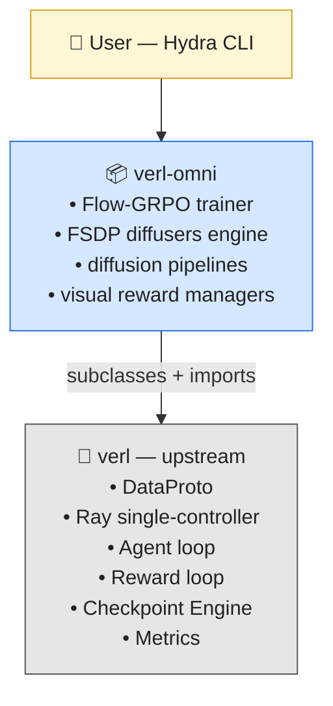
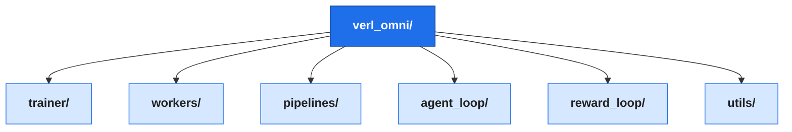
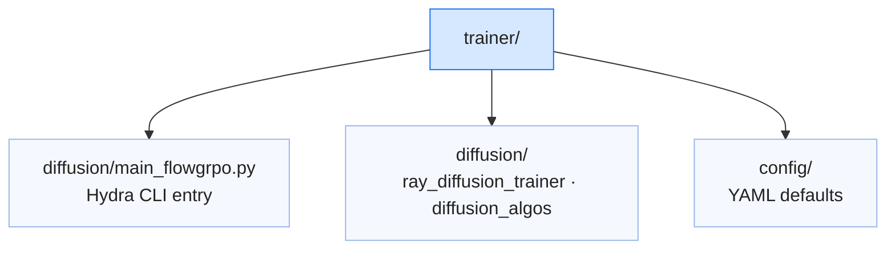
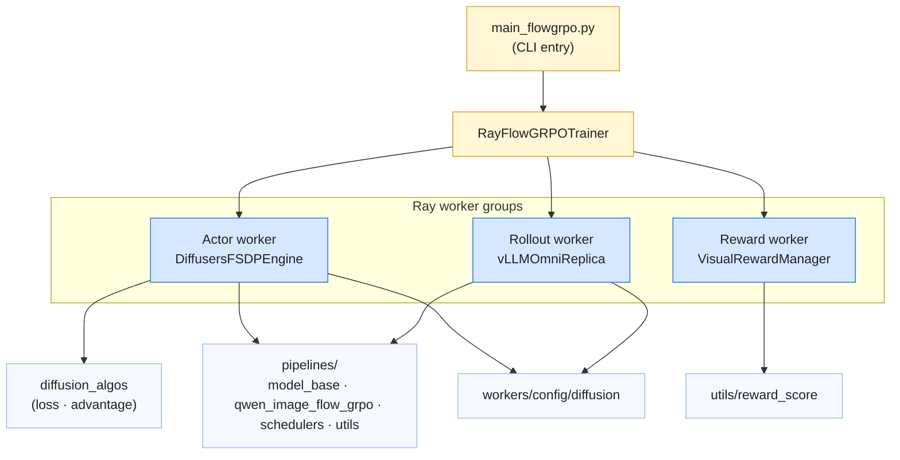
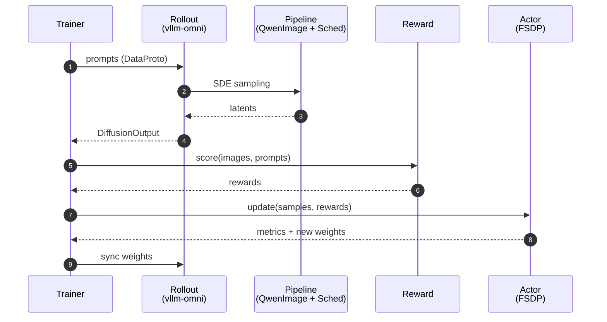

# verl-omni Architecture Overview

Last updated: 04/27/2026

This document gives community developers a visual map of **verl-omni**: its
modules, the main public APIs, how the modules talk to each other, and how the
project relates to the upstream [`verl`](https://github.com/verl-project/verl)
framework and the [`vllm-omni`](https://github.com/vllm-project/vllm-omni)
rollout backend.

---

## 1. The big picture

`verl-omni` is a **diffusion / multi-modal extension layer** that sits on top
of [`verl`](https://github.com/verl-project/verl) (the core RLHF framework). It does **not** fork verl: every verl-omni component either
**subclasses** an extension point exposed by verl (e.g. `AgentLoopBase`,
`RewardManagerBase`) or **directly imports** verl utilities (`DataProto`,
`RayWorkerGroup`, `ResourcePoolManager`, `CheckpointEngineManager`,
`Tracking`, …). The diffusion-specific pieces — Flow-GRPO trainer, FSDP
diffusers engine, diffusion pipelines/schedulers and visual reward
managers — live entirely in `verl_omni/`.



| Layer | Role | Examples of what verl-omni uses / extends |
|---|---|---|
| `verl` | Generic (LLM-focused) RLHF framework: Ray single-controller, FSDP, `DataProto`, checkpointing, metrics, dataset, tracking. | **Imports**: `verl.DataProto`, `verl.single_controller.ray.{RayWorkerGroup, ResourcePoolManager}`, `verl.checkpoint_engine.CheckpointEngineManager`, `verl.trainer.ppo.{utils, reward, metric_utils}`, `verl.utils.{tracking, fs, config, debug}`. **Subclasses**: `verl.experimental.agent_loop.AgentLoopBase`, `verl.experimental.reward_loop.RewardManagerBase`. |
| `verl-omni` | Adds **diffusion / image / video** training (Flow-GRPO), diffusers FSDP engine, diffusion pipelines & schedulers, visual reward managers, and the bridge to vllm-omni. | `RayFlowGRPOTrainer`, `DiffusersFSDPEngine`, `DiffusionModelBase`, `DiffusionSingleTurnAgentLoop`, `VisualRewardManager`. |

> **Note**: verl-omni does *not* subclass verl's `RayPPOTrainer`. Instead,
> `RayFlowGRPOTrainer` is a sibling single-controller that reuses verl's
> worker-group, dataset, checkpoint and metric utilities directly. This keeps
> the diffusion training loop independent of LLM-specific PPO assumptions
> while staying source-compatible with verl's data and resource
> abstractions.

---

## 2. Module map

The top-level `verl_omni/` package has six sub-packages:



Contents of each sub-package:



- **`diffusion/main_flowgrpo.py`** — CLI entry; calls `run_flowgrpo(config)` to bootstrap Ray and start the trainer.
- **`ray_diffusion_trainer.py`** — `RayFlowGRPOTrainer`, the single-controller that drives *rollout → advantage computation → actor update* each step.
- **`diffusion_algos.py`** — exposes `DIFFUSION_LOSS_REGISTRY` and `DIFFUSION_ADV_ESTIMATOR_REGISTRY`. To add a new loss or advantage estimator, decorate a function with `@register_diffusion_loss("name")` or `@register_diffusion_adv_estimator("name")` and set the matching key in the Hydra config.

```mermaid
Houses the Hydra CLI entry and the Flow-GRPO trainer:
- diffusion/main_flowgrpo.py: The CLI entry that calls run_flowgrpo(config).
- ray_diffusion_trainer.py: Contains RayFlowGRPOTrainer, the single-controller that drives the rollout -> advantage computation -> actor update loop.
- diffusion_algos.py: Exposes DIFFUSION_LOSS_REGISTRY and DIFFUSION_ADV_ESTIMATOR_REGISTRY. To add a new loss or advantage estimator, decorate a function with @register_diffusion_loss("name") or @register_diffusion_adv_estimator("name") and set the matching key in the Hydra config.
    WORKERS["workers/"]
    WORKERS --> W1["engine/fsdp/<br/>diffusers_impl"]
    WORKERS --> W2["rollout/vllm_rollout/<br/>vllm_omni_async_server"]
    WORKERS --> W3["config/diffusion/<br/>actor · model · rollout"]

    classDef group fill:#d6e8ff,stroke:#1f6feb,color:#222
    classDef leaf fill:#f5f8ff,stroke:#9ab8e8,color:#222
    class WORKERS group
    class W1,W2,W3 leaf
```

- **`engine/fsdp/diffusers_impl.py`** — `DiffusersFSDPEngine` wraps a HuggingFace diffusers model with FSDP (LoRA, mixed precision, gradient checkpointing, device-mesh sharding).
- **`rollout/vllm_rollout/`** — bridges `DataProto` batches to vllm-omni's `OmniDiffusionRequest` and collects `DiffusionOutput` per sample.
- **`config/diffusion/`** — three dataclass configs (`DiffusionActorConfig`, `DiffusionModelConfig`, `DiffusionRolloutConfig`) controlling mini-batch size, PPO epochs, LoRA ranks, and num-inference-steps.

To add a new engine backend, implement `BaseEngine` under `engine/` and register it with `EngineRegistry`.

```mermaid
- DiffusersFSDPEngine (engine/fsdp/diffusers_impl.py): Wraps a HuggingFace diffusers model with FSDP, handling LoRA, mixed precision, gradient checkpointing, and device-mesh sharding.
- Rollout (rollout/vllm_rollout/): Bridges DataProto batches to vllm-omni's OmniDiffusionRequest and collects DiffusionOutput per sample.
- Config (config/diffusion/): Holds dataclass configs (DiffusionActorConfig, DiffusionModelConfig, DiffusionRolloutConfig) that control mini-batch size, PPO epochs, LoRA ranks, and num-inference-steps.
- Extension: To add a new engine backend, implement BaseEngine under engine/ and register it with EngineRegistry.
    PIPES["pipelines/"]
    PIPES --> P0["model_base.py<br/>DiffusionModelBase + registry"]
    PIPES --> P1["qwen_image_flow_grpo/<br/>vllm_omni_rollout_adapter"]
    PIPES --> P2["schedulers/<br/>FlowMatchSDE…"]
    PIPES --> P3["utils.py<br/>build_scheduler + helpers"]

    classDef group fill:#d6e8ff,stroke:#1f6feb,color:#222
    classDef leaf fill:#f5f8ff,stroke:#9ab8e8,color:#222
    class PIPES group
    class P0,P1,P2,P3 leaf
```

- **`model_base.py`** — `DiffusionModelBase`, an ABC with three abstract methods (`build_scheduler`, `prepare_model_inputs`, `forward_and_sample_previous_step`). Register with `@DiffusionModelBase.register("ArchName")` where `ArchName` must match `_class_name` in the model's `model_index.json`.
- **`qwen_image_flow_grpo/`** — reference implementation for Qwen-Image.
- **`schedulers/`** — flow-match SDE schedulers.
- **`utils.py`** — top-level dispatch helpers (`build_scheduler`, `prepare_model_inputs`, `forward_and_sample_previous_step`) called by the FSDP engine.

To add a new architecture, create a sub-directory, implement the three abstract methods, and decorate the class with `@DiffusionModelBase.register("YourArchName")`.

```mermaid
- model_base.py: Defines DiffusionModelBase (ABC) with abstract methods build_scheduler, prepare_model_inputs, and forward_and_sample_previous_step.
- Registration: Use @DiffusionModelBase.register("ArchName"). ArchName must match the _class_name in the model's model_index.json.
- utils.py: Provides top-level dispatch helpers called by the FSDP engine.
- qwen_image_flow_grpo/: Reference implementation for Qwen-Image.
- Extension: To add a new architecture, create a sub-directory, implement the three abstract methods, and decorate the class with @DiffusionModelBase.register("YourArchName").
    AL["agent_loop/"]
    AL --> A1["diffusion_agent_loop.py"]
    AL --> A2["single_turn_agent_loop.py"]

    RL["reward_loop/"]
    RL --> R1["reward_manager/<br/>VisualRewardManager"]

    UTILS["utils/"]
    UTILS --> U1["vllm_omni/"]
    UTILS --> U2["reward_score/<br/>genrm_ocr · jpeg_compressibility"]
    UTILS --> U3["fs.py"]

    classDef group fill:#d6e8ff,stroke:#1f6feb,color:#222
    classDef leaf fill:#f5f8ff,stroke:#9ab8e8,color:#222
    class AL,RL,UTILS group
    class A1,A2,R1,U1,U2,U3 leaf
```

**`agent_loop/`**

- `DiffusionSingleTurnAgentLoop` (registered as `"diffusion_single_turn_agent"`) — subclasses verl's `AgentLoopBase`; handles prompt tokenisation, multi-modal data extraction, and a single async generation call to vllm-omni, returning a `DiffusionAgentLoopOutput` (prompt ids + image/video tensor + optional reward score).
- To add a new rollout strategy, subclass `AgentLoopBase` and decorate with `@register("name")`.

**`reward_loop/`**

- `VisualRewardManager` — extends verl's `RewardManagerBase`; dispatches to a configurable `compute_score` callable (sync or async) that receives the generated image tensor alongside `data_source`, `ground_truth`, and `extra_info`.
- To add a custom scorer, pass a callable as `compute_score` or place it in `utils/reward_score/`.

**`utils/`**

- `reward_score/genrm_ocr.py` — async OCR scoring by sending generated images to an OpenAI-compatible VLM router.
- `reward_score/jpeg_compressibility.py` — `jpeg_compressibility()` / `jpeg_incompressibility()` factory functions that measure JPEG file size as a reward signal.
- `vllm_omni/` — vllm-omni-specific helpers.
- `fs.py` — remote filesystem utilities.

---

## 3. Main public APIs

| API | Location | Purpose |
|---|---|---|
| `main()` / `run_flowgrpo(config)` | [verl_omni/trainer/diffusion/main_flowgrpo.py](../verl_omni/trainer/diffusion/main_flowgrpo.py) | Hydra CLI entry; bootstraps Ray and launches the trainer. |
| `RayFlowGRPOTrainer` | [verl_omni/trainer/diffusion/ray_diffusion_trainer.py](../verl_omni/trainer/diffusion/ray_diffusion_trainer.py) | Main single-controller trainer for Flow-GRPO. |
| `DiffusionModelBase` (+ `@register("Arch")`) | [verl_omni/pipelines/model_base.py](../verl_omni/pipelines/model_base.py) | Plug-in point for new diffusion architectures (auto-detected via `model_index.json`). |
| `DiffusionActorConfig` / `DiffusionModelConfig` / `DiffusionRolloutConfig` | [verl_omni/workers/config/diffusion/](../verl_omni/workers/config/diffusion/) | Dataclass configs (mini-batch, PPO epochs, LoRA, num inference steps, …). |
| `DiffusersFSDPEngine` | [verl_omni/workers/engine/fsdp/diffusers_impl.py](../verl_omni/workers/engine/fsdp/diffusers_impl.py) | FSDP training engine for diffusers models. |
| `vLLMOmniHttpServer` / `vLLMOmniReplica` | [verl_omni/workers/rollout/vllm_rollout/vllm_omni_async_server.py](../verl_omni/workers/rollout/vllm_rollout/vllm_omni_async_server.py) | Async rollout server bridging verl-omni and vllm-omni. |
| `DiffusionOutput` | [verl_omni/workers/rollout/replica.py](../verl_omni/workers/rollout/replica.py) | Structured rollout result (image tensor + metadata). |
| `VisualRewardManager` | [verl_omni/reward_loop/reward_manager/visual.py](../verl_omni/reward_loop/reward_manager/visual.py) | Reward manager registered as `"visual"` for image rewards. |
| Reward score fns (`genrm_ocr`, `jpeg_compressibility`, …) | [verl_omni/utils/reward_score/](../verl_omni/utils/reward_score/) | Drop-in callable rewards. |
| Example launch scripts | [examples/flowgrpo_trainer/](../examples/flowgrpo_trainer/) | End-to-end Qwen-Image OCR LoRA training. |

---

## 4. Module relations

Static dependency view — who calls whom inside verl-omni:



---

## 5. Runtime data flow of one Flow-GRPO step



**Key points**

- The trainer is the **single controller**; rollout, actor and reward run as
  independent Ray worker groups.
- Communication uses verl's `DataProto` so verl-omni stays compatible with
  verl's batching, sharding and checkpointing.

---

## 6. Where to start

1. Read [docs/start/install.md](start/install.md) and
   [docs/start/flowgrpo_quickstart.md](start/flowgrpo_quickstart.md).
2. Run an example: [examples/flowgrpo_trainer/run_qwen_image_ocr_lora.sh](../examples/flowgrpo_trainer/run_qwen_image_ocr_lora.sh).
3. **New diffusion model**: subclass `DiffusionModelBase` under
   [verl_omni/pipelines/](../verl_omni/pipelines/)
   and register it.
4. **New reward**: add a function under
   [verl_omni/utils/reward_score/](../verl_omni/utils/reward_score/) and wire
   it through `VisualRewardManager`.
5. **New pipeline / scheduler**: add it under
   [verl_omni/pipelines/](../verl_omni/pipelines/) and register
   with the vllm-omni rollout adapter.
