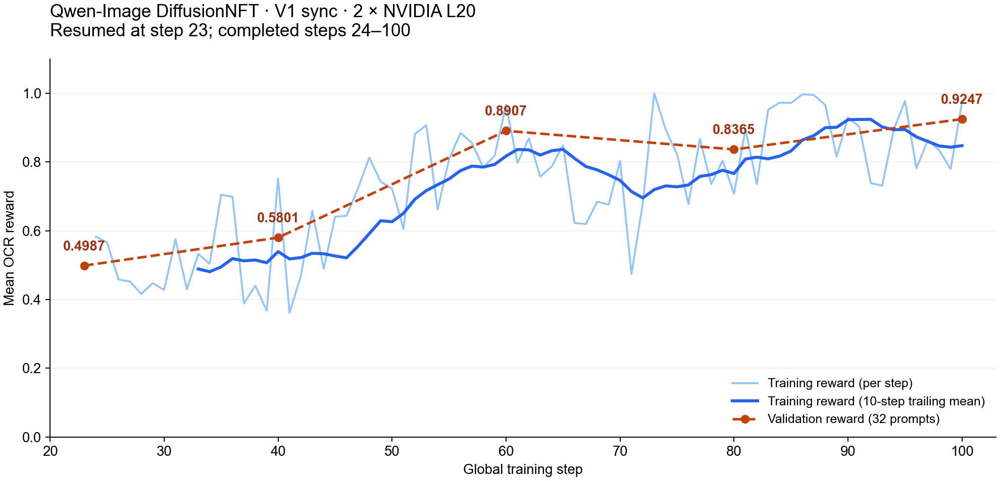
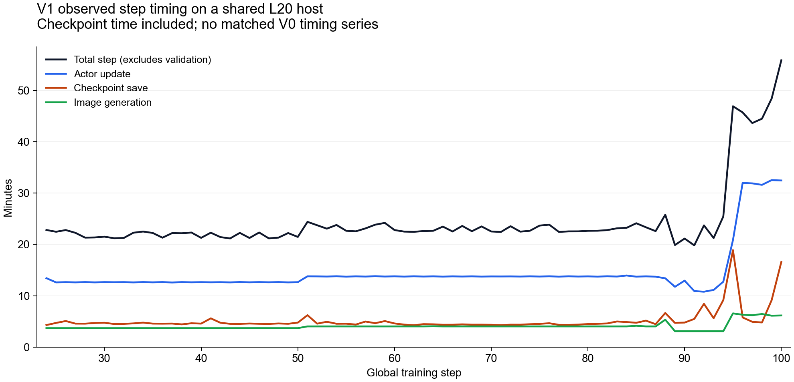

# Qwen-Image DiffusionNFT V1 sync: L20 training results

Last updated: 09/15/2026

Run `ocr-v1-100-12` resumed from `ocr-v1-100-11/global_step_23` and completed
all 77 subsequent training steps, reaching global step 100. Final validation
finished on September 15, 2026 at 13:08 UTC; the training process exited with
code 0. This is a resumed run, not an uninterrupted step-0-to-100 experiment.
The separate historical 48-step experiment in the PR is not spliced into this
series.

## Reward

| Global step | Validation mean OCR reward (32 prompts) |
| --- | --- |
| 23, immediately after restore | 0.4986821790 |
| 40 | 0.5800898186 |
| 60 | 0.8906557611 |
| 80 | 0.8364970256 |
| 100 | 0.9247436151 |

The final validation score is the highest among these five evaluations, an
absolute increase of 0.4260614361 from the restored checkpoint. This supports
learning in this V1 run; 32 validation prompts and one run do not establish
statistical convergence or equivalence to V0. Dashed lines connect observed
validation points; they do not represent additional evaluations. The blue
smoothed line is a trailing mean over 10 complete training steps.

The last training reward is 0.9739583731. All 77 logged actor losses are finite
and all logged gradient norms are finite and positive. Each step generates
16 images (4 prompts, 4 images per prompt), totaling 1,232 training images in
this resumed process. These checks do not prove gradient correctness: the raw
log retains the FSDP2 view/pre-backward-hook warning for review.

## Timing

For steps 24–100, observed total step p50/p95 are 1,352.846/2,683.093 seconds.
Steps 95–100 have a median of 2,777.765 seconds. These totals include checkpoint
saving and exclude validation. Final validation took 3,085.640 seconds in
addition to the last training step. The host was shared, and checkpoint costs
vary substantially. A matched full-model V0 run is still missing, so these
measurements do not establish V0/V1 performance parity or a speedup.

## Configuration and provenance

- Two NVIDIA L20 GPUs; Qwen-Image with Qwen3-VL-8B-Instruct OCR reward.
- V1 sync, FSDP2, BF16 LoRA rank 64 / alpha 128, parameter and optimizer CPU
  offload, distributed layerwise rollout offload, rollout TP=2 and reward TP=2.
- Batch 4; 4 images per prompt; mini-batch 2; per-GPU micro-batch 1;
  512×512 images; 10 training and 40 validation inference steps; seed 42.
- The runtime snapshot used verl-omni base
  `c0c88fc88a7d85367a5a4dfcee9f01346e71dda5` with the candidate recipe, verl
  core `fefb080262e1c015a0ea05f958822a6a512dc795`, and vllm-omni
  `ded8934626aaad1a3e816c3a1d9d742efc012d93`. This is not a GPU rerun of the
  newer PR submission base.
- Runtime changes also included a bounded ZMQ weight-transfer wait/cleanup
  repair in verl core and experiment-specific checkpoint scheduling. The
  repaired transport file SHA-256 is
  `735af3d1ff5a83755798a51bcaf542dd5302cb8e9cda15eff22bae7fb50fc00b`.
  These runtime changes are not introduced into trainer code by this results
  attachment. Runtime startup patches and warnings remain in the full log.
- Exact overrides, model/data revisions and hashes, recipe/runner hashes,
  resume lineage and exit status are in [launch.json](launch.json).
  Defaults printed early in the log are superseded by the recorded overrides;
  the resolved job is in [resolved.yaml](resolved.yaml).

## Attached evidence

- [Readable driver log](driver.log), including startup, restore, every recorded
  training step, warnings, and final validation. Only terminal escape sequences,
  carriage-return formatting and trailing whitespace have been normalized.
- [Byte-preserved original log, gzip](driver.log.gz). Its decompressed SHA-256 is
  `7a7e35e9a4aa274af9e006e318fbe37819e314a4ef0cb29dbe0648a2c1527c6a`.
- [Training metrics CSV](train_metrics.csv) and
  [validation metrics CSV](validation_metrics.csv), extracted from that log.
- [Machine-readable summary](summary.json).
- [Final checkpoint completion manifest](checkpoint_manifest.json): global
  step 100, both model shards, optimizer shards, extra-state shards and loader
  state. The model checkpoint itself is not committed, and loading the final
  checkpoint in a new process has not been tested here.
- [SHA-256 checksums](SHA256SUMS) for the attached data and figures.

The figures were generated with Matplotlib 3.9.4 from the attached metrics.
Validation checked contiguous steps 24–100, five validation records, finite
losses and positive finite gradients, matching launch/step records, exit code
0, and the final checkpoint manifest. No new model training was launched to
prepare this attachment.
