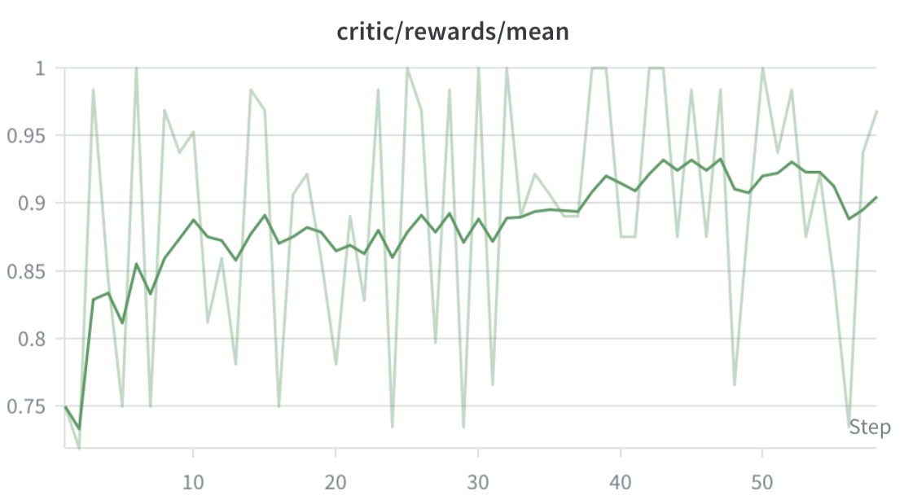

# Qwen3-Omni Thinker GSPO Trainer

This example shows how to post-train the **Qwen3-Omni-30B-A3B Thinker** with
**GSPO** on a math-reasoning task, using FSDP for the actor and `vllm-omni` as
the async rollout backend. Two input modalities are supported: **text → text**
(e.g. `MATH-lighteval`) and **image → text** (e.g. `MMK12`).

Both **GPU** and **NPU** training platforms are supported via two launch scripts:

- [`run_qwen3_omni_thinker_gspo_lora.sh`](qwen3_omni/run_qwen3_omni_thinker_gspo_lora.sh)
  — **GPU**, **LoRA (r=64)** on a single node with **4 × H100/H200 80GB**.
- [`run_qwen3_omni_thinker_gspo_npu.sh`](qwen3_omni/run_qwen3_omni_thinker_gspo_npu.sh)
  — **NPU**, **full-parameter** on a single **Atlas 800T A3** node with **16 NPUs**.

For the base environment setup, see the [installation guide](../../docs/start/install.md).

## Installation

Follow the [installation guide](../../docs/start/install.md) to set up the base
environment (vLLM + vLLM-Omni). This recipe was last validated end-to-end on the
following stack (rollout↔actor pearson ≈ 0.993):

| Component | Version |
| --- | --- |
| vLLM | `0.22.0` |
| vLLM-Omni | `0.22.0` (the `v0.22.0` release tag) |
| transformers | `5.x` |
| torch | `2.11.0+cu130` |
| flash-attn | `2.8.3` |
| accelerate | `1.12.0` |
| verl | `05b262b6` (w/ FSDP LoRA fixes) |
| TransferQueue | `0.1.8` (imported by verl's V1 trainer that runs this recipe) |

This pins to the upcoming `vllm 0.22.0` + `vllm-omni 0.22.0` release so the recipe
stays aligned with what maintainers ship.

```bash
# vLLM + vLLM-Omni rollout backend
pip install vllm==0.22.0
pip install "vllm-omni @ git+https://github.com/vllm-project/vllm-omni.git@v0.22.0"

# vllm-omni's CLI entrypoints import pydub at startup but don't declare it
pip install pydub

# verl (pinned to a main commit that includes the FSDP layered-summon fix)
pip install "verl @ git+https://github.com/verl-project/verl.git@05b262b6"

# verl's V1 trainer (TaskRunnerV1) imports TransferQueue at startup; main_ppo
# fails with ModuleNotFoundError without it, and it is not always pulled transitively
pip install TransferQueue==0.1.8

# verl-omni (this repo)
pip install -e .
```

> **Requires transformers 5.x.** The Thinker MoE experts are stored as fused
> 3-D tensors that PEFT cannot target directly; the `qwen3_omni_thinker` patch
> unfuses them into per-expert `nn.Linear` right before LoRA injection so
> `target_modules` reaches the expert `gate_proj/up_proj/down_proj`.

> **flash-attn needs a CUDA toolkit matching torch.** torch `2.11.0+cu130` is
> built against CUDA 13; building flash-attn from source against a system CUDA 12.x
> `nvcc` fails the version check. If you hit this, point `CUDA_HOME` at the
> pip-installed `nvidia/cu13` toolkit (`export CUDA_HOME=$(python -c "import os,
> nvidia; print(os.path.join(os.path.dirname(nvidia.__file__), 'cu13'))")`)
> before `pip install flash-attn==2.8.3 --no-build-isolation`.

Verify:

```bash
python -c "import verl, verl_omni, vllm, vllm_omni; print('OK')"
```

The run scripts set
`export VERL_USE_EXTERNAL_MODULES=verl_omni,verl_omni.models.transformers.qwen3_omni_thinker`,
so verl loads both on the driver via its `VERL_USE_EXTERNAL_MODULES` hook:
`verl_omni` registers the `vllm_omni` rollout adapter, and the
`qwen3_omni_thinker` submodule applies the Qwen3-Omni processor / automodel
patches before the driver's dataset loader runs. The GPU workers load the same
model patch via `actor_rollout_ref.model.external_lib`.

The two launch scripts colocate the FSDP actor and the `vllm-omni` rollout on
the same devices. `run_qwen3_omni_thinker_gspo_lora.sh` targets a single node with **4 × H100/H200 80GB**
(30B + LoRA r=64 with param/optimizer offload, rollout TP=4). `run_qwen3_omni_thinker_gspo_npu.sh` targets
a single **Atlas 800T A3** node with **16 NPUs** (full-parameter FSDP actor,
rollout TP=2). Multi-node is not yet validated on either platform.

> **Where the rollout engine's memory/batching is set.** When
> `stage_configs_path` is provided, vLLM-Omni **ignores** the top-level engine
> args verl passes (`gpu_memory_utilization`, `max_num_seqs`, `load_format`,
> `dtype`, LoRA, …) — the per-stage YAML takes precedence. So the rollout engine
> runs with the values in
> [`qwen3_omni/qwen3_omni_thinker_only.yaml`](qwen3_omni/qwen3_omni_thinker_only.yaml)
> (e.g. `gpu_memory_utilization: 0.4`), kept low because the engine **shares each
> GPU with the FSDP actor**. To change rollout memory/batching, edit that stage
> file, not the verl rollout config.

> `vllm==0.22` pulls `numpy>=2.x` while verl/verl-omni still pin `numpy<2.0.0`;
> the codepaths used here are numpy-2 compatible, so the pip resolver warning is
> safe to ignore.

## Prepare the model

The script uses the HuggingFace Hub ID `Qwen/Qwen3-Omni-30B-A3B-Instruct`
(~60 GB), cached automatically on first run. To use a local copy, set
`MODEL_PATH`:

```bash
export MODEL_PATH=/path/to/local/Qwen3-Omni-30B-A3B-Instruct
```

> **Use the Instruct variant.** The base checkpoint ships no
> `tokenizer.chat_template`; verl's dataset loader calls
> `tokenizer.apply_chat_template(...)` and fails without it.

## Training with `MATH-lighteval`

### Prepare the dataset

A parquet dataset of math problems with `prompt` and `answer` fields, defaulting
to `~/data/math/{train,test}.parquet`. The example was tested on
`MATH-lighteval`; any standard RL math dataset works. To convert HuggingFace
datasets into verl's parquet format, see
[`verl/examples/data_preprocess/`](https://github.com/verl-project/verl/tree/main/examples/data_preprocess).

```bash
mkdir -p ~/data/math
# … place train.parquet and test.parquet here …
ls ~/data/math/   # train.parquet  test.parquet
```

### Run training

Launch from the repository root — pick the flavor that matches your hardware:

```bash
# GPU, LoRA (r=64), 4 × H100/H200
bash examples/gspo_trainer/qwen3_omni/run_qwen3_omni_thinker_gspo_lora.sh

# NPU, full-parameter, 16 × Atlas 800T A3
bash examples/gspo_trainer/qwen3_omni/run_qwen3_omni_thinker_gspo_npu.sh
```

The recipe config lives in
[`qwen3_omni/config/qwen3_omni_thinker_gspo.yaml`](qwen3_omni/config/qwen3_omni_thinker_gspo.yaml),
which inherits verl's default `ppo_trainer` config and overrides the GSPO/LoRA
fields. The launch script passes it via `--config-name` and only sets volatile
values (data/model paths, GPU/node counts, the vLLM-Omni stage config path) on
the command line. Config precedence, lowest to highest:

```
verl ppo_trainer defaults  →  qwen3_omni/config/qwen3_omni_thinker_gspo.yaml  →  CLI overrides
```

So any field can be overridden from the command line without editing the yaml:

```bash
MODEL_PATH=/local/Qwen3-Omni-30B-A3B-Instruct \
bash examples/gspo_trainer/qwen3_omni/run_qwen3_omni_thinker_gspo_lora.sh \
    trainer.total_epochs=10 \
    actor_rollout_ref.actor.optim.lr=2e-6
```

To verify the wiring before a full run, use the end-to-end GSPO smoke test
[`tests/special_e2e/run_gspo_qwen3_omni_thinker_lora_smoke.sh`](../../tests/special_e2e/run_gspo_qwen3_omni_thinker_lora_smoke.sh),
which trains on a tiny random-weight model built by
[`build_qwen3_omni_tiny_random.py`](../../tests/special_e2e/build_qwen3_omni_tiny_random.py)
(no 60 GB download). It is wired into the `tests/gpu_smoke` CI suite as Test 8.

### What is trained

Only the **Thinker** (`Qwen3OmniMoeThinkerForConditionalGeneration`):

- **GPU (LoRA)** — rank 64, alpha 32, on
  `target_modules="q_proj,k_proj,v_proj,o_proj,gate_proj,up_proj,down_proj"`
  (explicit names so the unfused MoE expert `gate/up/down_proj` are targeted,
  not just attention).
- **NPU (full-parameter)** — LoRA is disabled (`lora_rank=0`); all Thinker
  parameters are updated under FSDP.
- `exclude_modules` strips talker / code2wav / code_predictor / visual /
  audio_tower; `freeze_vision_tower=True` keeps the vision encoder cold.
- The non-Thinker heads are dropped at FSDP-wrap time via `_verl_strip_modules`.

Reward comes from the `dapo` reward manager (math accuracy on parsed answers).

Healthy signals (one full step takes ~9–21 min on 4×H100, depending on the
sampled response length):

- `training/rollout_actor_probs_pearson_corr` > 0.95 (actor ↔ rollout agree
  after weight sync) — the primary correctness signal.
- `actor/loss` ≈ 1e-4…1e-3, `actor/grad_norm` ∈ [1e-3, 1], no OOM
  (`actor/perf/max_memory_allocated_gb` < 65).
- `val-core/.../acc/mean@1` rising with steps.

### Performance (GPU + LoRA)

> Measured on a single node of **4 × H100/H200 80GB**, actor and rollout
> colocated, MATH-lighteval, `dapo` reward, LoRA r=64
> (`run_qwen3_omni_thinker_gspo_lora.sh`).

| Script | Model | Algorithm | # Cards (colocate) | Batch × `rollout.n` | lr | Steps | Throughput (tok/gpu/s) | Time / Step (s) | val acc/mean@1 | rollout↔actor pearson |
| --- | --- | --- | --- | --- | --- | --- | --- | --- | --- | --- |
| `run_qwen3_omni_thinker_gspo_lora.sh` | Qwen3-Omni-30B-A3B Thinker | GSPO + LoRA (r=64) | 4 | 8 × 8 = 64 | 1e-6 | 60 | ~16–48 | ~530–1260 | 0.90 | 0.993 |

The step time is dominated by rollout generation and swings with the sampled
response length (mean `response_length` ranged ~0.7k–3.6k tokens over the run, up
to `max_response_length=8192` with `rollout.n=8`); `actor/perf/max_memory_allocated`
peaks at ~64 GB.

### Preliminary results (GPU + LoRA)

Over a 60-step run with the default LoRA config, the training reward
(`critic/rewards/mean`) rises from **~0.75 to ~0.90** and validation accuracy on
MATH-lighteval is **~0.90**. Treat this
as a plumbing-correctness signal (finite loss, reasonable grad norm, rollout↔actor
pearson ≈ 0.99, no OOM) rather than evidence the recipe is tuned — gains are slow
because the Instruct base is already a strong zero-shot solver, LoRA r=64 has
limited capacity against a 30B base, and the binary math reward yields
low-variance advantages on a high-baseline policy.



## Training with `MMK12`

For visual math reasoning we ship an end-to-end pipeline on top of the
[MMK12](https://huggingface.co/datasets/FangqingM/MMK12) dataset (image
input + text output, K12 math). It reuses the same GSPO recipe as the
text-only path — only the data preprocessing and the reward scorer differ.
The launch example below uses the NPU / full-parameter flavor
(`run_qwen3_omni_thinker_gspo_npu.sh`), but the GPU / LoRA flavor works too
after pointing it at the MMK12 parquet.

### Prepare the dataset

Download the raw MMK12 parquet shards (from ModelScope or HuggingFace) into a
local directory — the loader expects filenames like `train-*.parquet` and
`test-*.parquet` — and convert them into the verl RL parquet layout with:

```bash
python examples/gspo_trainer/data_process/mmk12.py \
    --input_dir  /path/to/mmk12/ \
    --output_dir ~/data/mmk12
```

The converter emits one verl RL row per problem, with
`data_source="math_dapo"`, a system prompt that constrains the model to emit
`<answer>…\boxed{…}…</answer>`, and the image bytes carried inline in the
`images` column so the parquet stays self-contained. Dropped samples (empty
question / answer, undecodable image) and answer-type tallies are printed at
the end. See the module docstring in
[`data_process/mmk12.py`](data_process/mmk12.py) for the exact output schema.

### Run training

The MMK12 reward scorer grades responses with
[`math_verify`](https://github.com/huggingface/math-verify), which is **not**
pulled in transitively by verl or verl-omni. Install it explicitly first —
otherwise the scorer falls back to `accuracy = 0` for every sample:

```bash
pip install math-verify
```

Then point the launcher at the MMK12 parquet and register the custom reward
scorer via CLI overrides (no yaml edits required):

```bash
TRAIN_FILE=$HOME/data/mmk12/train.parquet \
VAL_FILE=$HOME/data/mmk12/test.parquet \
bash examples/gspo_trainer/qwen3_omni/run_qwen3_omni_thinker_gspo_npu.sh \
    reward.custom_reward_function.path=verl_omni/utils/reward_score/mmk12_reward.py \
    actor_rollout_ref.actor.optim.lr=3e-6
```

The scorer combines `math_verify` accuracy with a progressive format reward on
the `<answer>…\boxed{}…</answer>` template; see
[`verl_omni/utils/reward_score/mmk12_reward.py`](../../verl_omni/utils/reward_score/mmk12_reward.py)
for the full formula.

## Logging

W&B logging is enabled by default:

```bash
export WANDB_API_KEY=<your_wandb_api_key>
# trainer.project_name / experiment_name are already set in the script
```

## File map

```
examples/gspo_trainer/
├── qwen3_omni/
│   ├── run_qwen3_omni_thinker_gspo_lora.sh   ← launch script (GPU, LoRA r=64)
│   ├── run_qwen3_omni_thinker_gspo_npu.sh    ← launch script (NPU, full-parameter)
│   ├── config/
│   │   └── qwen3_omni_thinker_gspo.yaml      ← recipe config (inherits verl ppo_trainer)
│   ├── qwen3_omni_thinker_only.yaml          ← vllm-omni stage config (GPU)
│   └── qwen3_omni_thinker_only_npu.yaml      ← vllm-omni stage config (NPU)
├── data_process/
│   └── mmk12.py                              ← MMK12 → verl RL parquet converter
├── reward.png                                ← preliminary reward curve
└── README.md                                 ← (this file)
```
