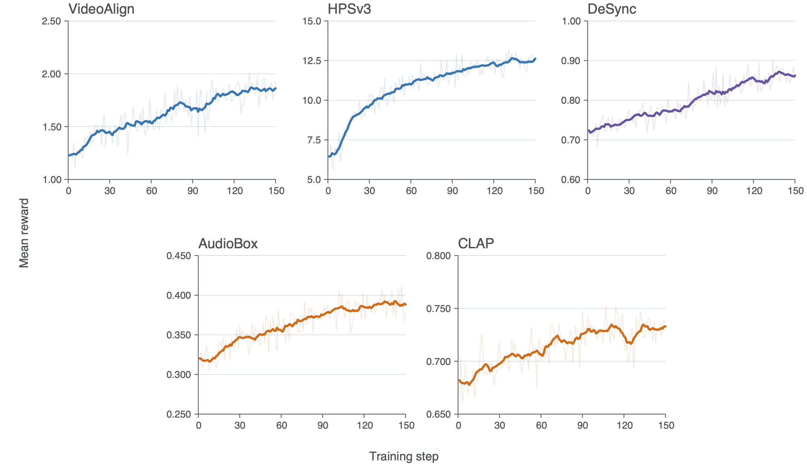
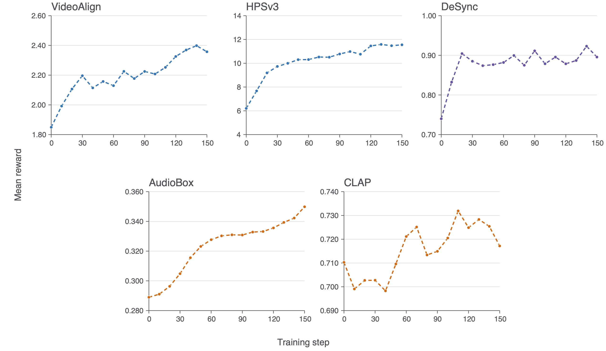

# OmniNFT training

This directory contains the production LTX-2.3 OmniNFT recipe.

Set up the repository by following the
[NPU installation guide](../../docs/start/install_npu.md), then run the commands
below from the repository root. The launcher accepts environment variables for
local model, reward-model, data, and output paths.

## Prepare data

Convert the native OmniNFT VGGSound
[`train_metadata_20k.jsonl`](https://github.com/zghhui/OmniNFT/blob/fb9237f6e74edf0d0f2a683f4d975b79fde588fe/dataset/vggsound/train_metadata_20k.jsonl)
and
[`test_metadata.jsonl`](https://github.com/zghhui/OmniNFT/blob/fb9237f6e74edf0d0f2a683f4d975b79fde588fe/dataset/vggsound/test_metadata.jsonl)
to the standard RLHF parquet schema:

```bash
python3 examples/omninft_trainer/data_process/prepare_data.py
```

By default, the converter reads both files from the pinned OmniNFT revision
`fb9237f6e74edf0d0f2a683f4d975b79fde588fe` and writes `train.parquet` and `test.parquet` to
`./data/omninft/vggsound/verl_omni`. Local JSONL paths can be supplied with `--train_file` and `--val_file`. Each row
keeps the joint generation prompt, stable prompt-group `uid`, separate video/audio reward prompts, and native source
metadata. The standard `RLHFDataset` reads these files.

## Prepare model assets

```bash
bash examples/omninft_trainer/download_models.sh
```

This downloads the pinned LTX-2.3 base model, installs the reward-specific
Python packages, downloads all pinned reward checkpoints and Qwen2-VL base
models, checks out the pinned OmniNFT Synchformer source, and verifies the core
files. The default `outputs` locations match the launcher. Set `MODEL_ROOT` and
`REWARD_ROOT` consistently for another location. If the LTX-2.3 base model is
already available, run `download_reward_models.sh` directly to prepare only
the rewards. Review the licenses of the reward repositories and checkpoints
before use.

## Launch

```bash
WANDB_MODE=offline \
bash examples/omninft_trainer/ltx2/run_ltx2_3_omninft_lora_npu_bs32.sh
```

The example uses a batch size of 32, eight rollouts per prompt, 256 generated
samples per step, eight TP=2 rollout replicas with one sample per
replica, LoRA rank/alpha 32/64, and a learning rate of `3e-5`. Rollout CPU
offload is disabled. Actor mini/micro batch sizes are 32/8. Validation runs
every 10 steps with 16 prompts, and checkpoints are saved every 50 steps.
Override `DATA_DIR`, `MODEL_PATH`, `REWARD_ROOT`, or `OUTPUT_DIR` for local
paths. The recipe sets `actor_rollout_ref.rollout.max_num_seqs=1`.
Training batches and eight rollouts per prompt use separate engine requests.

## Results

### Video comparisons

<details>
<summary><b>Woman</b></summary>

<details>
<summary>Prompt</summary>

In a medium close-up, a young woman with blonde shoulder-length hair stands in a lavender field under a twilight sky. She says, "告诉我这条光滑的绿色带子见证了多少年的沉重。" The audio features gentle, atmospheric singing establishing a calm and wistful mood.

</details>

| Reference | Trained |
|:---:|:---:|
| <video src="https://github.com/user-attachments/assets/a8b4ddff-41ae-4221-b985-23e910647244" controls></video> | <video src="https://github.com/user-attachments/assets/17c2e67a-a97f-48a5-a1c4-0396518d1c07" controls></video> |

</details>

<details>
<summary><b>Piano</b></summary>

<details>
<summary>Prompt</summary>

In a studio with beige brick walls and a light gray floor, a man wearing a black fedora, a white T-shirt, and dark jeans sits on a brown leather bench. He leans forward, his hands positioned to play a wooden upright piano in a medium shot captured from a slight high angle. Two condenser microphones on boom arms are positioned above the piano's open lid, and professional lighting equipment, including a black floor lamp and several stands, is arranged around him, casting a warm glow on the scene. From this perspective, the man's hands move with focus across the piano keys. Below the keyboard, his feet in black sneakers actively work the instrument's pedals as well as a pedalboard with effects units resting on the floor. His performance unfolds within the initial framing, with the microphones, brick wall texture, and surrounding equipment remaining visible throughout the shot. The audio shows soft piano notes being played, filling the space with the sound of the performance.

</details>

| Reference | Trained |
|:---:|:---:|
| <video src="https://github.com/user-attachments/assets/e4ebebe2-e060-45fa-9024-3818bb7349f9" controls></video> | <video src="https://github.com/user-attachments/assets/71319c70-e66d-4edb-84e1-d4b1561e90c8" controls></video> |

</details>

<details>
<summary><b>Humanoid</b></summary>

<details>
<summary>Prompt</summary>

An extreme close-up centers on a whimsical humanoid figure made entirely of green leafy vegetables under bright, natural daylight. His skin and hair are textured like kale, while broccoli forms his neck and shoulders. With large white eyes and an open mouth, he holds both arms raised outward in a garden setting, where blurred green foliage creates a soft, out-of-focus background. The figure's leafy hands gesture animatedly toward the viewer. His arched eyebrows lift higher, and his eyes widen in an expression of surprise. He then leans forward, bringing his face closer to the camera, his expression shifting to one of earnest eagerness as he begins to speak. He says, "Oh, how did you find me? Although it is a bit inappropriate, for the sake of your health, I hope you remember to eat more vegetables." The audio shows only the character's spoken dialogue. No other ambient sound, music, or sound effects are present.

</details>

| Reference | Trained |
|:---:|:---:|
| <video src="https://github.com/user-attachments/assets/ad4c7d46-0204-4062-80ae-b52f0ea0b804" controls></video> | <video src="https://github.com/user-attachments/assets/9ca3a3c2-f09a-4a29-924d-cea7c4347ad4" controls></video> |

</details>

<details>
<summary><b>Anime</b></summary>

<details>
<summary>Prompt</summary>

In a vibrant, anime-style 3D game world, a female character with blonde hair, wearing a white and blue coat with red boots, walks away from the camera across a vast expanse of violet grassland. The scene is lit by the warm oranges and yellows of a sunset sky, where a large, rocky mountain in the distance erupts with fire and smoke. A long, green leaf-like object extends horizontally across the middle of the frame, above a calm body of water and fields of purple and blue flora. A user interface displays “一只飞来洲 bilibili” beside a cartoon dragon logo in the top-left corner and “尊贵的DJ机主” next to a character portrait and a boxed number “1” in the top-right. In the bottom-right, a green circular button holds a white mushroom symbol. The character's walking pace quickens to a run as swirling green energy, representing a wind-element skill, gathers around her hands in visible gusts and particles. As she advances, several fantastical creatures suddenly emerge from the ground ahead of her, their forms materializing amidst the purple grass. With a swift forward gesture, she unleashes a powerful whirlwind that erupts from her position. The vortex of air and debris immediately lifts the creatures, tumbling them violently in the air. As they are caught in the whirlwind, red health bars appear above each monster and deplete rapidly. The surrounding violet grass and uniquely shaped trees bend and sway violently in the powerful gusts emanating from her attack, while the mountain in the background continues to spew fire and smoke. The audio shows a deep, continuous rumble of distant explosions echoing from the fiery mountains. This is layered with the sounds of the character's footsteps on the grass, a charging whoosh as the wind skill activates, and the powerful, gusting roar of the ensuing whirlwind. The violent swaying of flora adds a rustling texture to the soundscape, alongside UI sound effects indicating the rapid depletion of the creatures' health bars.

</details>

| Reference | Trained |
|:---:|:---:|
| <video src="https://github.com/user-attachments/assets/a8ac6edc-6720-4c49-b003-7bfa954208da" controls></video> | <video src="https://github.com/user-attachments/assets/eaec5a13-7b90-4301-9e38-a99f2ba83933" controls></video> |

</details>

<details>
<summary><b>Soldiers</b></summary>

<details>
<summary>Prompt</summary>

In a wide shot with a desaturated, cinematic quality, six soldiers in dark World War II-era British military uniforms and helmets walk away from the camera down the center of a narrow, paved street. The scene is captured with deep focus under diffuse, overcast daylight. Leaflets and small papers drift steadily from the sky, scattering across the road amidst other debris. The street is flanked by two-story brick and plaster houses with chimneys and utility lines, and a seventh soldier stands on the left sidewalk, facing slightly toward the group. The soldiers, with rifles slung over their shoulders and some carrying backpacks, wander slowly forward through the eerily empty setting. Suddenly, their aimless pace changes. They slow their walk and their bodies tense, their posture shifting into a slight crouch. Gripping their rifles tightly, they bring the weapons from their shoulders into a ready position, aiming them forward down the street and heightening the tension of the moment. The audio shows a quiet atmosphere dominated by the faint sound of wind and distant, intermittent bird calls. This stillness is abruptly broken by a series of explosions that echo from afar, their reverberations cutting through the silence.

</details>

| Reference | Trained |
|:---:|:---:|
| <video src="https://github.com/user-attachments/assets/00e2f395-6d2c-477a-9268-1f791a33f1a0" controls></video> | <video src="https://github.com/user-attachments/assets/c7ac2996-5ed5-421c-879d-0e6c0f9e21f6" controls></video> |

</details>

<details>
<summary><b>Sailing</b></summary>

<details>
<summary>Prompt</summary>

17th century sailing ship making a path through the waves during a storm.

</details>

| Reference | Trained |
|:---:|:---:|
| <video src="https://github.com/user-attachments/assets/e3cda433-fc61-4d6d-8861-e060ec5f6676" controls></video> | <video src="https://github.com/user-attachments/assets/9cb16ab8-3b62-4901-9969-1fc1ec5b9a76" controls></video> |

</details>

### Reward curves

Training and validation rewards are shown through step 150, with five panels
per figure. Thin training curves show raw values and bold curves show smoothed
trends; validation points are joined by dashed lines. Each reward panel uses
its own y-axis scale.

#### Training



#### Validation



## Routing

Routing is keyed by reward name. Video receives weights `1.0`, `1.5`, and
`1.0` from VideoAlign, HPSv3, and DeSync. Audio receives weights `0.5`, `1.0`,
and `1.0` from AudioBox, CLAP, and DeSync.
